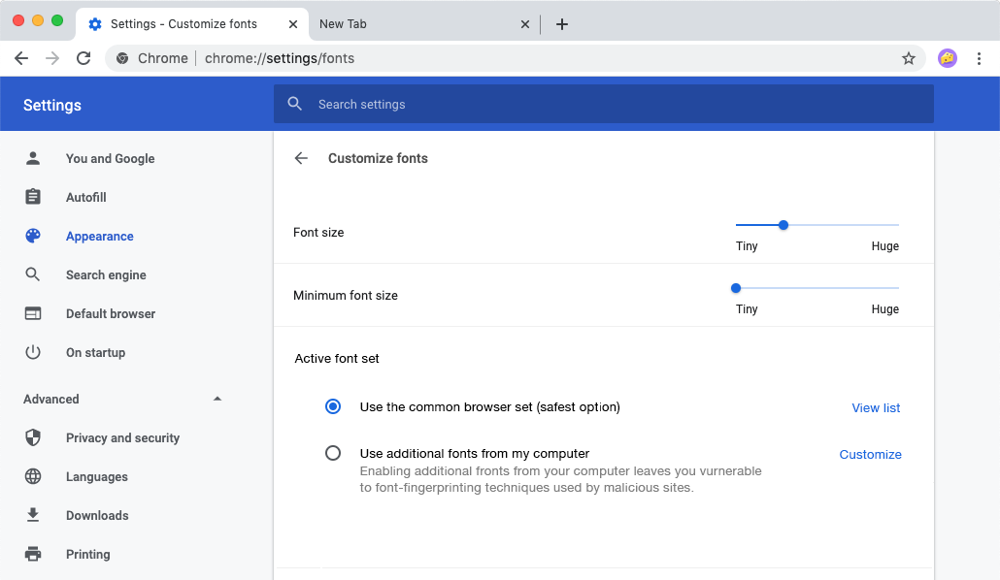
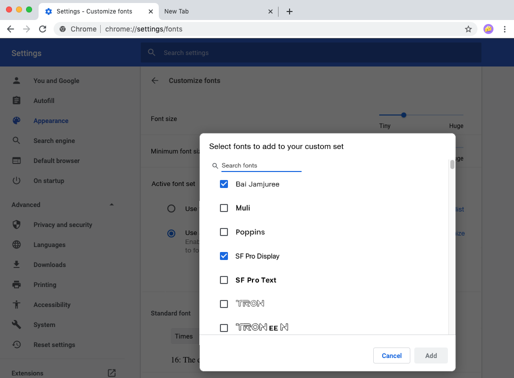

# Font Fingerprinting Protection Through Better Defaults and Measurement Hinting

## Author

* Pete Snyder <pes@brave.com>

## Terms

*   **OS Fonts**: The set of all fonts provided by the OS, including 
    language-specific fonts that may not be enabled for all users.
*   **System Fonts**: The set of all fonts known to the operating system,
    whether they were provided by the operating system vendor, or installed
    later by the user (intentionally or otherwise).
*   **Web Fonts**: The set of fonts installed by the website, over HTTP(S),
    either locally or across origins.
*   **Hinted Fonts**: A set of fonts, beyond the set of OS fonts, that the
    browser things sites will want to access for benign, user serving reasons.
*   **Selected Fonts**: A set of fonts, explicitly selected by the user,
    for use in websites.
*   **Page Fonts**: The full set of fonts a website can access.  Currently, in
    most browsers this is the full set of system Fonts union web fonts
    loaded by the page.  This proposal would change this set to be OS Fonts
    union Web Fonts union Hinted Fonts (per language setting) union selected
    fonts.

## Problem

Currently, popular web browsers make all fonts the operating system knows about
available to websites.  Fingerprinting websites look for uncommonly installed
fonts as a way to build pseudo-identifiers.  Well known fingerprinting scripts
like
[fingerprint2.js](https://github.com/Valve/fingerprintjs2/blob/master/fingerprint2.js#L537)
use the technique to re-identify users across sessions, storage resets, etc.
These uncommonly installed fonts can make their way onto the system in many ways
users don’t expect: office suites / Microsoft products, layout tools, fonts
downloaded from the web, etc.

Font fingerprinting is mainly enabled because there is a gap between fonts
on a users' machine, and fonts the user intends to use when browsing the web;
Browsers currently allow websites to access all fonts the OS knows about,
when what users need is just the minimal increase beyond the set of fonts
provided by the OS or loaded by a website.

The rest of this proposal limits and describes a proposal for building a better,
privacy preserving default for what fonts websites can access, with mechanisms
for vendors to further tailor this default font set for different language
groups. Further, it defines a common mechanism (and, possibly, feedback loop)
for users to instruct the browser to expose additional fonts to websites.

## Solution Requirements

A solution to font fingerprinting should provide privacy protection without
breaking the following use cases:

### 1. Must work with existing sites

We can’t “fiat” into existence better sites that move to WebFonts; a solution
should make web browsing on existing sites private and functional.

### 2. Must be compatible with regionally required fonts

Some languages / linguistic communities have been poorly served by OS provided
fonts, and so have developed the expectation that users will have certain fonts
installed, beyond what the OS provides. A privacy-preserving solution must be
compatible with such needs, without greatly harming the privacy of other users.

### 3. Must not increase user complexity beyond current levels

In order to be useful, a font-fingerprinting solution must be on by default, and
can’t require non-trivial additional complexity for users to configure. A
solution must not require the common case user to take extra steps, and cannot
require users currently taking extra steps (e.g. installing a required font) to
need to take significant further steps.

### 4. Must maintain the decentralized nature of the web

The web being decentralized is a core part of what makes it valuable and open
compared to other platforms.  Decentralization makes the system more censorship
resistant, allows for new browsers to join the platform and offer new features,
and generally prevents any one party from shutting out others.  A solution for
fixing font fingerprinting must not harm or reduce the decentralized nature of
the web.

## Proposal

### Changes from Current Functionality

Current most browsers determine the set of page fonts as:

> page fonts = system fonts ∪ web fonts

This proposal would make the following changes (using the terms from the "terms"
section):

> hinted fonts = fonts, beyond OS provided fonts, that the browser vendor
> vendor thinks would be useful to users with a given language setting.  The
> method for determining this set is intentionally not defined by this spec,
> though it would be a good place for vendor / w3c / community collaboration.

> selected fonts = fonts, from the set of system fonts, but not from the set of
> OS fonts, explicitly selected by the user for websites to access.  Note
> that this could overlap with the hinted fonts set.

The set of page fonts would then be defined as

> page fonts = os fonts ∪ web fonts ∪ hinted fonts ∪ selected fonts.

### Interface Changes

Clients should change this functionality so that instead websites can only
access fonts bundled with their OS (as can be determined through existing and
manually created lists), plus "hinted" fonts" (following section).

Users can then, through the settings system (e.g. brave://settings/fonts) select
additional fonts that websites can access from the fonts the operating system
knows about but doesn’t bundle.  These users are already expecting to take minor
additional steps to get sites to work for them (i.e. installing additional
fonts); with good public documentation we can lead these users to the relevant
Browser-specific settings for making these changes.

### Determining Hinted Fonts

Browsers can further ease the process for users who rely on uncommon fonts by
doing web measurements to identify further expected (for benign purposes) fonts
per language, and adding those fonts to the default allowed font set.

These web measurements would involve crawling large number of sites serving
different languages, and configured with different accept-language settings, and
observing what fonts are requested for benign-seeming purposes (e.g. applied to
large amounts of text per page over the lifetime of the page, without relevant,
OS-provided font fallbacks). We can use this crawl data to build tuples of
`(lang, font face name)`, and include these fonts in the default allow set for
users with the relevant language selected.

This crawl data might be further augmented from browser telemetry, describing
what additional fonts users have opted into the "selected fonts" set.

While it would be ideal for these measurements to be shared among vendors,
there is no need to (vendors could differ in the default supported fonts if
they wished).  The spec would only require that browsers have a default
that is less than "all fonts the OS knows about", and a similar method that
users can use to expand the default set.

## Sample User Interface

The below presents a straw-rendering of how the user interface might look.
Labels and text are placeholder, but the example is meant to demonstrate two
things: (i) the required capabilities of the new settings functionality, and
(ii) that while its expected that few users will need to adjust these settings,
the steps needed are not more complex than whats needed to install a system
font.

*Mockup demonstrating the default setting (i.e. OS provided fonts, with
measurement-learned additions).*

*Mockup demonstrating UI for adding a page font.*
